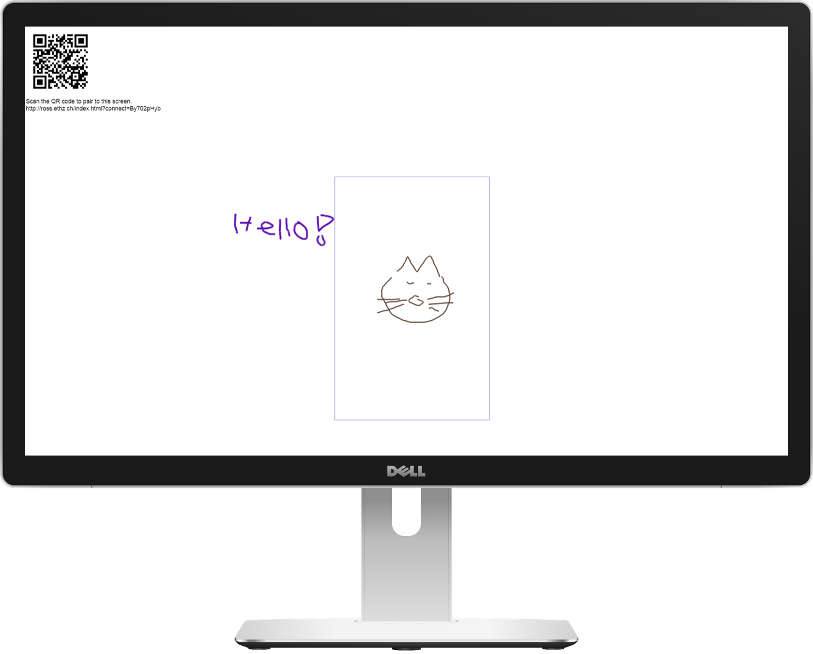
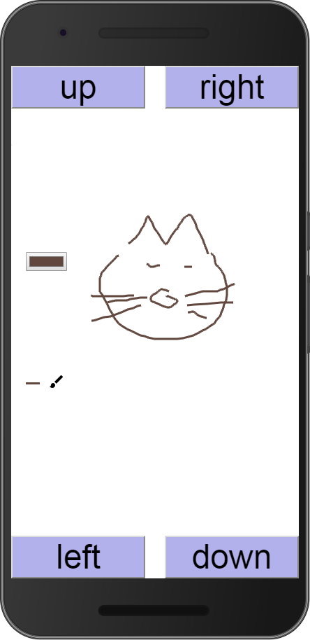

# Cross-device Graffiti
This is a digital graffiti wall or note board that was built with the [XD-MVC cross-device framework](https://github.com/mhusm/XD-MVC)

Load the canvas onto a large screen and use a mobile phone to paint on the canvas. The screen will display a QR code for pairing the phone.

After scanning the code, the phone is connected to the screen and you can start drawing. As the canvas is expected to be larger than the phone screen, you can navigate the viewport on the phone with button (gestures might be added in the future). The outline of each phone is shown on the large screen. The border colour matches the button colour on the phone so that, in case of multiple users, it is easy to find your location on the screen. Multiple phones can be connected simultaneously, but need to take turns drawing. You can choose the colour and stroke size using buttons.

